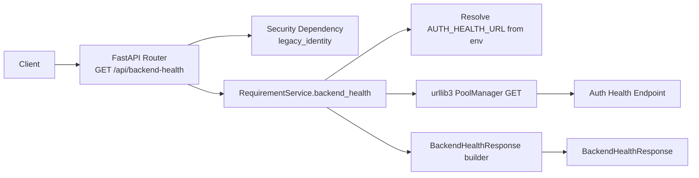

# get-api-backend-health.component

```mermaid
flowchart LR
    A[Client] --> B[FastAPI Router\nGET /api/backend-health]
    B --> C[Security Dependency\nlegacy_identity]
    B --> D[RequirementService.backend_health]
    D --> E[Resolve AUTH_HEALTH_URL from env]
    D --> F[urllib3 PoolManager GET]
    F --> G[Auth Health Endpoint]
    D --> H[BackendHealthResponse builder]
    H --> I[BackendHealthResponse]

```
